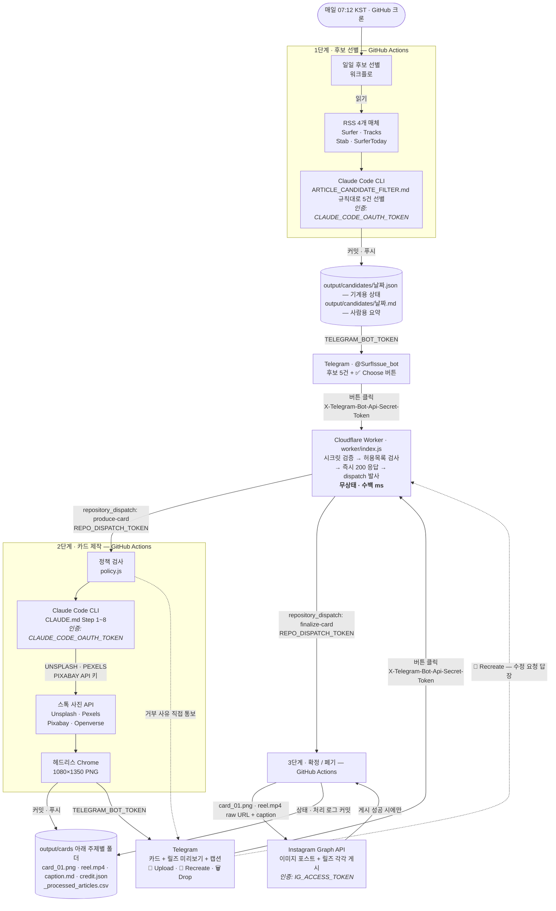
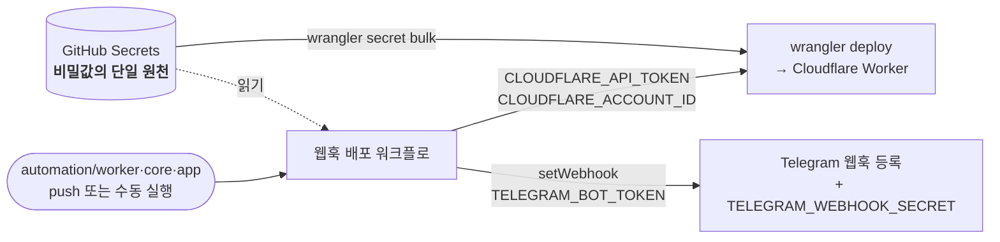
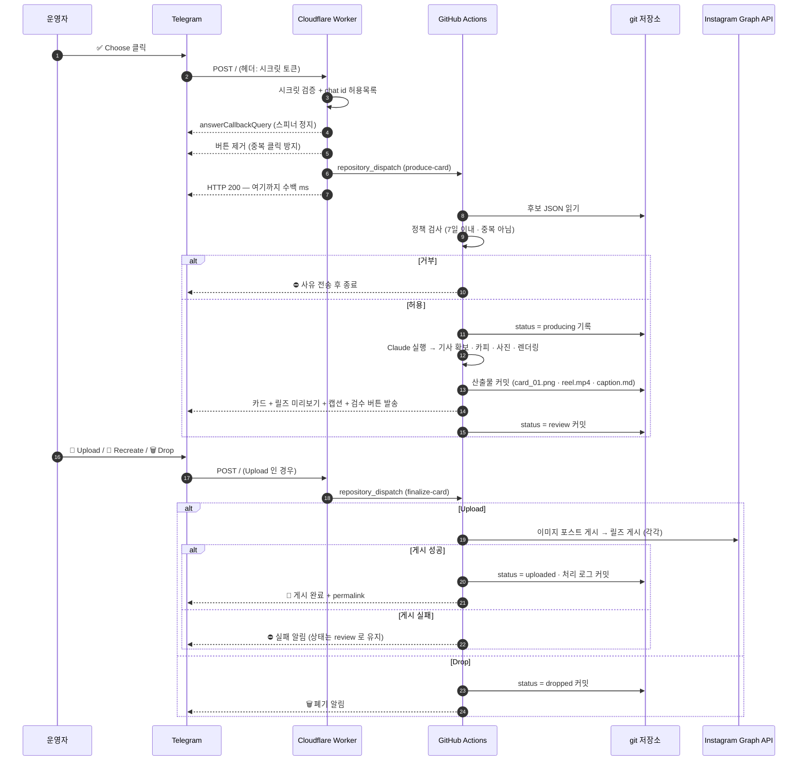
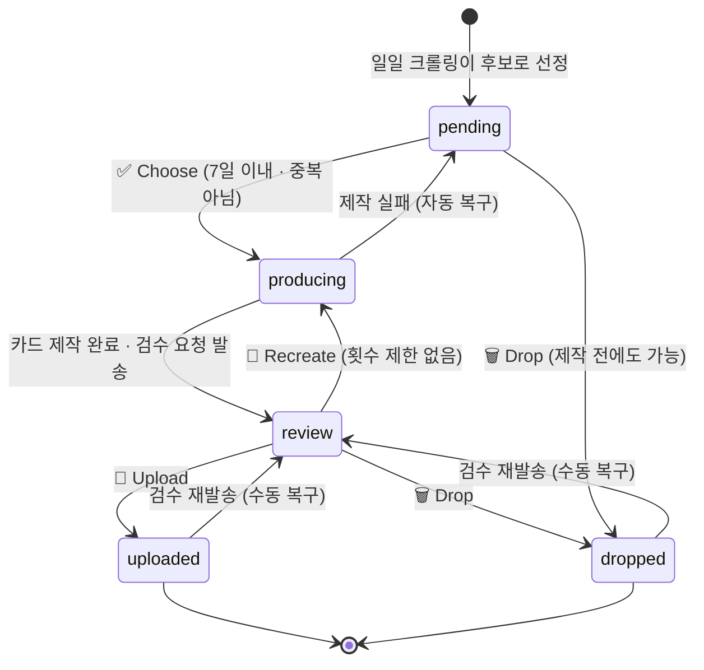
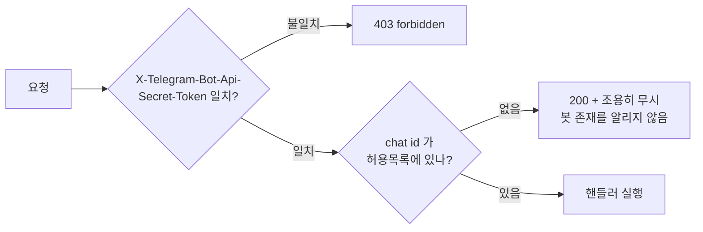

# 아키텍처

RSS 수집부터 인스타그램 실제 게시까지, **로컬 컴퓨터 없이** 돌아가는 파이프라인의 구조 문서입니다.
콘텐츠 규칙은 [CARDNEWS.md](CARDNEWS.md)·[DESIGN.md](DESIGN.md)에, 설치 절차는
[automation/README.md](automation/README.md)에 있습니다. 이 문서는 **무엇이 어디서 돌고, 무엇으로 인증하는가**만 다룹니다.

---

## 1. 전체 구조

위에서 아래로 한 방향으로 흐릅니다. 화살표에 적힌 것이 그 단계에서 쓰이는 **인증 수단**입니다.

설정·배포 경로는 런타임과 분리되어 있습니다. 코드를 push 하거나 수동 실행할 때만 돕니다.

### 왜 두 층으로 나눴는가

| 제약 | 결과 |
|---|---|
| Telegram 은 웹훅이 몇 초 안에 200 을 주지 않으면 **같은 업데이트를 재전송**한다 | 웹훅은 즉시 응답만 하고, 실제 작업은 다른 곳으로 넘긴다. 안 그러면 버튼 한 번에 카드가 여러 장 생긴다 |
| 서버리스 웹훅에서 **헤드리스 크롬을 못 돌린다** | 렌더링은 러너가 맡는다 |
| 워커가 git 저장소를 볼 수 없다 | **정책 판단도 러너에서** 한다. 워커는 "요청이 왔다"만 전달하고 거부 사유는 러너가 Telegram 으로 직접 알린다 |
| 상태 저장소(KV·DB)를 두면 관리 지점이 늘어난다 | 상태를 **git 에 커밋**한다. 저장소가 곧 상태이자 아카이브이고, 모든 변화가 커밋 이력에 남는다 |

---

## 2. 버튼 한 번에 일어나는 일

> **14 → 15 순서가 중요합니다.** 상태를 git 에 저장하는 설계에서는 "상태를 바꾸는 코드"가
> "커밋하는 단계"보다 먼저 실행되어야 그 변경이 살아남습니다. 실제로 이 순서가 뒤집혀
> 상태가 `producing` 에 갇히고 이후 모든 버튼이 거부되는 버그가 있었습니다
> (러너 안에서는 전부 성공으로 보여 다음 버튼을 눌렀을 때에야 드러남).
> `automation/test/workflow-order.test.mjs` 가 이 순서를 검사합니다.

---

## 3. 후보의 상태 기계

한 후보는 `output/candidates/YYYY-MM-DD.json` 안에서 아래 상태를 오갑니다.

> `review → uploaded` 전이는 이미지 포스트와 릴즈가 **둘 다 성공했을 때만** 일어난다.
> 하나라도 실패하면 상태는 `review` 에 남고, 성공한 쪽의 permalink 가 후보 파일에
> 기록된다 — Upload 를 다시 누르면 **이미 올라간 것은 건너뛰고 실패한 것만** 재시도해
> 같은 글이 두 번 게시되지 않는다.

정책은 [automation/app/policy.js](automation/app/policy.js) 한 곳에 모여 있습니다.

| 정책 | 값 | 근거 |
|---|---|---|
| 후보 나이 상한 | **7일** | 버튼은 대화 이력에 영원히 남아 오래된 후보를 누르는 일이 생긴다. `ARTICLE_CANDIDATE_FILTER.md` 3-1 의 수집 범위와 같은 값으로 맞춰, "후보로는 뜨는데 누르면 거부되는" 구간을 없앴다 |
| 하루 제작 개수 | **제한 없음** | 그날 몇 개를 만들지는 운영자 재량 |
| 재생성 횟수 | **제한 없음**, 3회차부터 경고 | 마음에 들 때까지 돌릴 수 있어야 하되, 매회 Claude 실행·API 호출·러너 시간이 든다는 사실은 알린다 |
| 중복 클릭 | 차단 | 버튼은 클릭 시 제거되지만, 다른 기기에 열려 있던 화면에서는 여전히 눌린다 |

---

## 4. 구성 요소

| 구성 요소 | 실행 위치 | 역할 |
|---|---|---|
| [automation/core/](automation/core/) | 워커 + 러너 공용 | **프로젝트 무관 재사용 레이어** — Telegram 클라이언트, Instagram Graph API 클라이언트, 버튼 인코딩, 라우터, 인증, GitHub dispatch |
| [automation/app/](automation/app/) | 워커 + 러너 공용 | 이 프로젝트 전용 — 액션 정의, 후보 상태 파일, 운영 정책 |
| [automation/worker/](automation/worker/) | Cloudflare | 웹훅 엔트리. core + app 배선만 담당 |
| [automation/scripts/](automation/scripts/) | GitHub Actions | 후보/결과 발송, 정책 검사, 렌더링, 상태 복구, 커밋·푸시 |
| [automation/prompts/](automation/prompts/) | GitHub Actions | Claude 에게 주는 지시서. 워크플로 YAML 과 분리해 heredoc 들여쓰기 충돌을 피함 |
| [templates/](templates/) | 러너 | 디자인 규칙의 실행 가능한 구현체 (`cover.html` + `template.css`) |
| [.claude/skills/stock-image-search/](.claude/skills/stock-image-search/) | 러너 | 스톡 사진 4곳 동시 검색 · 다운로드 · 크레딧 정리 |

### 워크플로

| 이름 | 트리거 | 하는 일 |
|---|---|---|
| 일일 후보 선별 | cron `12 22 * * *` (07:12 KST) · 수동 | RSS → 후보 5건 → 커밋 → Telegram 발송 |
| 카드뉴스 제작 | `repository_dispatch: produce-card` · 수동 | 정책 검사 → 카드 제작 → 커밋 → 검수 요청 |
| 확정 / 폐기 | `repository_dispatch: finalize-card` · 수동 | Upload 시 이미지 포스트 + 릴즈를 각각 게시 → **둘 다** 성공해야 상태 확정·처리 로그 기록 |
| 검수 재발송 | 수동 | 버튼이 사라진 카드를 다시 발송 (복구 경로) |
| 웹훅 배포 | `automation/worker·core·app` push · 수동 | 워커 배포 + 시크릿 동기화 + 웹훅 등록 |

---

## 5. 인증 · 비밀값

**모든 비밀값은 GitHub Secrets 한 곳에만 둡니다.** 워커 시크릿은 「웹훅 배포」가
`wrangler secret bulk` 로 동기화하므로, Cloudflare 대시보드에서 따로 관리하지 않습니다.
두 곳에 나눠 두면 나중에 값이 어긋나도 알아채기 어렵기 때문입니다.

| 이름 | 저장 위치 | 쓰는 곳 | 용도 |
|---|---|---|---|
| `CLAUDE_CODE_OAUTH_TOKEN` | GitHub Secrets | 러너 | Claude 구독으로 CLI 실행 (`claude setup-token` 발급) |
| `TELEGRAM_BOT_TOKEN` | GitHub Secrets → 워커 | 양쪽 | Bot API 호출 |
| `TELEGRAM_CHAT_ID` | GitHub Secrets → 워커 | 양쪽 | 발송 대상이자 **허용목록** |
| `TELEGRAM_WEBHOOK_SECRET` | GitHub Secrets → 워커 | 워커 | 요청이 진짜 Telegram 에서 왔는지 검증 |
| `REPO_DISPATCH_TOKEN` | GitHub Secrets → 워커 | 워커 | `repository_dispatch` 발사. GitHub 이 `GITHUB_` 접두사를 금지해 이 이름을 쓰고, 워커 안에서 `GITHUB_TOKEN` 으로 매핑 |
| `CLOUDFLARE_API_TOKEN` | GitHub Secrets | 배포 워크플로 | 워커 배포 |
| `CLOUDFLARE_ACCOUNT_ID` | GitHub Secrets | 배포 워크플로 | 계정 지정 |
| `UNSPLASH_ACCESS_KEY` | GitHub Secrets | 러너 | 스톡 사진 (선택) |
| `PEXELS_API_KEY` | GitHub Secrets | 러너 | 스톡 사진 (선택) |
| `PIXABAY_API_KEY` | GitHub Secrets | 러너 | 스톡 사진 (선택) |
| `IG_ACCESS_TOKEN` | GitHub Secrets | 러너 (finalize) | Instagram Graph API 장기 토큰 — **60일 후 만료, 수동 갱신** |
| `IG_USER_ID` | GitHub Secrets | 러너 (finalize) | 게시 대상 Instagram 비즈니스 계정 ID |
| `BGM_PASSPHRASE` | GitHub Secrets | 러너 (produce) | 릴즈 배경음악(`input/bgm/bgm.mp3.gpg`) 복호화 암호 — 음원 원본은 라이선스상 저장소에 둘 수 없어 암호화본만 커밋한다 |

로컬 작업용 `.env` 는 스톡 사진 키만 담으며 `.gitignore` 되어 있습니다.
Openverse 는 키가 필요 없습니다.

### 봇 접근 통제

봇 사용자명은 공개 정보라 누구나 말을 걸 수 있고, 저장소가 public 이라 워커 URL 도 유추될 수 있습니다.
그래서 **두 겹**으로 막습니다.

시크릿만으로는 부족합니다 — 제3자가 봇에게 직접 말을 걸어도 Telegram 은
정상적으로 우리 웹훅을 호출하기 때문입니다. 허용목록이 없으면 누구나 카드를 만들게 할 수 있습니다.
허용목록이 비어 있으면 **전부 거부**합니다(fail closed).

---

## 6. 알려진 제약

| 제약 | 영향 | 대응 |
|---|---|---|
| IG 장기 토큰은 60일 후 만료 | 만료 후 `🚀 Upload` 시 게시 실패 (후보는 `review` 에 그대로 남아 재시도 가능) | 자동 갱신 없음 — `automation/README.md` 2-6 절차로 수동 재발급 |
| 릴즈 배경음악이 한 곡 고정 | 모든 릴즈가 같은 음악·같은 15초 구간 | `make-reel.mjs` 의 `BGM_START_SECONDS` 로 구간만 조정 가능 |
| 릴즈는 인스타그램에서 취소 불가 | Upload 후 마음에 안 들면 앱에서 직접 삭제 | 검수 단계에서 영상 미리보기를 먼저 보냄 |
| AI 이미지 생성 사용 안 함 | 무인 실행이라 비용 승인을 받을 수 없음 | 원문 이미지 → 스톡 → 프리셋 배경 순으로 폴백 |
| 버튼은 일회용 | 누르면 제거되어 되돌릴 수 없음 | 「검수 재발송」 워크플로로 복구 |
| 동시 제작 시 푸시 충돌 | 같은 후보 JSON 을 두 러너가 수정 | `commit-push.sh` 가 rebase 후 최대 5회 재시도 |
| GitHub 크론 지연 | 정시에 안 돌 수 있음 (수십 분) | 정각을 피한 07:12 로 설정 |
