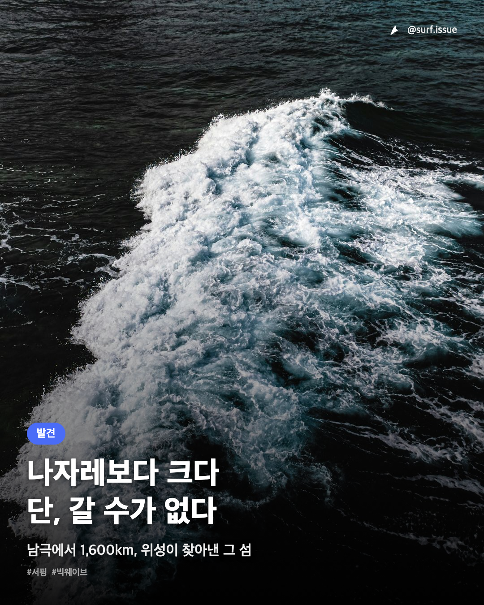

# 서핑슈 카드뉴스 자동화

서핑 뉴스 기사 URL 하나로 인스타그램 카드뉴스(**표지 이미지 1장 + 캡션**)를 만드는 파이프라인입니다.
인스타그램 [@surf.issue](https://instagram.com/surf.issue) 계정용 콘텐츠를 매일 생산합니다.

RSS 수집 → 후보 선별 → Telegram 승인 → 카드 렌더링 → 아카이브까지 이어지며,
**로컬 컴퓨터가 꺼져 있어도 동작합니다.**



<sub>실제 생성 결과 (1080×1350). 배경은 스톡 사진, 카피·레이아웃은 파이프라인이 생성.</sub>

---

## 1. 무엇을 자동화하는가

하루 한 장의 카드뉴스를 만들려면 원래 이런 일을 해야 합니다 — 서핑 매체 4곳을 훑고, 한국 서퍼가 반응할 기사를 고르고, 후킹되는 헤드라인을 뽑고, 저작권 안전한 배경 사진을 찾고, 디자인 규격에 맞춰 렌더링하고, 캡션을 쓰고, 중복 제작을 막게 기록합니다.

이 저장소는 그 전 과정을 하나의 파이프라인으로 묶고, 사람은 **Telegram 버튼 몇 번**만 누르도록 만든 것입니다.

```
매일 07:12 KST
      │
      ▼
RSS 4개 매체 크롤링 ──▶ 점수화·하드컷 ──▶ 후보 5개
      │                                      │
      │                          Telegram 으로 발송
      │                                      ▼
      │                            [✅ Choose] 버튼
      │                                      │
      ▼                                      ▼
Cloudflare Worker (수백 ms 내 200 응답) ──▶ GitHub Actions
                                             │
                    기사 확보 → 카피 작성 → 배경 사진 검색
                    → HTML 렌더링 → 1080×1350 PNG
                                             │
                                    Telegram 으로 결과 발송
                                             ▼
                        [🚀 Upload] [🔁 Recreate] [🗑 Drop]
                                             │
                                     git 저장소에 아카이브
```

**설계상의 핵심 결정 하나:** Telegram 웹훅은 몇 초 안에 200을 받지 못하면 같은 업데이트를 재전송합니다. 카드 제작은 수 분이 걸리므로 웹훅에서 직접 처리하면 카드가 여러 장 만들어집니다. 그래서 **즉시 응답하는 Cloudflare Worker**와 **오래 도는 GitHub Actions**를 `repository_dispatch`로 분리했습니다. 서버리스 웹훅이 헤드리스 크롬을 못 돌린다는 제약도 같은 방향을 가리킵니다.

자세한 내용은 [automation/README.md](automation/README.md)에 있습니다.

---

## 2. 저장소 구조

이 프로젝트의 특이한 점은 **핵심 로직이 코드가 아니라 마크다운 문서에 있다**는 것입니다.
카피 규칙·디자인 규칙·선별 기준은 Claude Code가 읽고 실행하는 명세이고,
코드는 그 결정을 실제 파일로 만드는 얇은 접착층입니다.

### 문서 — 파이프라인의 실질적인 소스코드

| 파일 | 역할 |
|---|---|
| [ARTICLE_CANDIDATE_FILTER.md](ARTICLE_CANDIDATE_FILTER.md) | **어떤 기사를 고를지** — RSS 피드 목록, 점수화 기준, 하드컷, 중복 제외 규칙 |
| [CLAUDE.md](CLAUDE.md) | **전체 지도 + 제작 프로세스** — Step 0~9 오케스트레이션 |
| [CARDNEWS.md](CARDNEWS.md) | **무엇을 쓸지** — 카드 카피·캡션 브리핑 규칙, 톤, 금지사항 |
| [DESIGN.md](DESIGN.md) | **어떻게 보일지** — 색상·폰트·레이아웃 규칙 |

새 세션에서 작업할 때는 위 순서대로 읽으면 전체 맥락이 잡힙니다.

### 코드 · 자산

| 경로 | 내용 |
|---|---|
| [templates/](templates/) | 디자인 규칙의 실행 가능한 구현체. `cover.html` + `template.css`가 현재 사용하는 조합 |
| [automation/](automation/) | Telegram 봇 · Cloudflare Worker · 러너 스크립트 ([전용 README](automation/README.md)) |
| [.github/workflows/](.github/workflows/) | 일일 후보 선별 · 카드 제작 · 확정/폐기 3종 워크플로 |
| [.claude/skills/stock-image-search/](.claude/skills/stock-image-search/) | 스톡 사진 검색 스킬 (Unsplash·Pexels·Pixabay·Openverse 4곳 동시 검색) |
| `output/cards/<slug>/` | 생성 결과 — `card_01.png`, `caption.md`, `bg.jpg`, `credit.json` |
| `output/sample/` | 디자인 회귀 테스트용 고정 샘플. 건드리지 말 것 |
| `output/cards/_processed_articles.csv` | 제작 완료 기사 로그. 다음 날 중복 추천을 막는 데 쓰임 |

---

## 3. 빠른 시작

### 카드 한 장을 로컬에서 만들기

Telegram·Actions 없이 손으로 돌려보는 경로입니다. Claude Code에서:

```
다음 URL 아티클로 카드뉴스 만들어줘: <기사 URL>
```

`CLAUDE.md`의 Step 0~9가 그대로 실행됩니다. 렌더링에는 헤드리스 크롬이 필요합니다:

```bash
"/Applications/Google Chrome.app/Contents/MacOS/Google Chrome" \
  --headless --disable-gpu --hide-scrollbars \
  --force-device-scale-factor=1 --window-size=1080,1350 \
  --screenshot="card_01.png" "file://$(pwd)/card_01.html"
```

### 자동 파이프라인 켜기

Telegram 봇 생성, GitHub Secrets, Cloudflare Worker 배포, 웹훅 등록까지
전체 설치 절차는 [automation/README.md](automation/README.md) 2번 섹션에 있습니다.

수동으로 워크플로를 깨울 수도 있습니다:

```bash
gh workflow run "일일 후보 선별"
gh workflow run "카드뉴스 제작" -f date=2026-07-27 -f index=2
```

### 환경 변수

[.env.example](.env.example)을 `.env`로 복사해 채웁니다.
스톡 사진 API 키는 전부 선택 사항이며, 없으면 `template.css`의 프리셋 배경으로 폴백합니다.

---

## 4. 기술 스택

| 영역 | 사용 기술 |
|---|---|
| 콘텐츠 생성 | Claude Code (문서 명세 기반) |
| 승인 인터페이스 | Telegram Bot API |
| 웹훅 | Cloudflare Workers (무상태 — KV·DB 없음) |
| 실행 | GitHub Actions |
| 렌더링 | 헤드리스 Chrome + HTML/CSS |
| 스톡 사진 | Unsplash · Pexels · Pixabay · Openverse |
| 런타임 | Node 20+ (automation), Python 3 표준 라이브러리만 (스킬 스크립트) |

상태 저장소를 쓰지 않는 것이 의도적인 선택입니다. 후보 정보는
`output/candidates/YYYY-MM-DD.json`에 있고 git에 커밋되므로, **저장소 자체가 상태이자 아카이브**입니다.

### 테스트

```bash
cd automation && node --test test/
```

실제 Telegram 호출 없이 워커 전체 흐름을 검증합니다.

---

## 5. 크레딧 · 라이선스

카드 배경에 스톡 사진을 쓴 경우, 각 카드 폴더의 `credit.json`에 저작자 정보가 있고
`caption.md` 출처란에 표기됩니다 (Unsplash API 가이드라인상 필수).

생성된 카드뉴스와 캡션의 저작권은 서핑슈([@surf.issue](https://instagram.com/surf.issue))에 있습니다.
인용된 기사 본문·인용문의 권리는 각 원문 매체에 있습니다.

<!--
TODO: 프로젝트 배경 — 아래 한 문단은 직접 채워주세요.
왜 이걸 만들었는지(수작업으로 며칠 해보다 자동화했는지, 특정 계정 운영 목표가 있었는지 등)는
저장소를 읽어서는 알 수 없는 정보라, 여기에 두 줄만 있어도 README 설득력이 크게 올라갑니다.
필요 없으면 이 주석 블록만 지우면 됩니다.
-->
